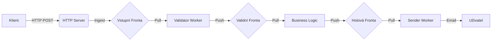

# Form Processing Server

## 1. Účel projektu

Backendový systém pro asynchronní zpracování formulářových žádostí. Implementuje vzor **Producer–Consumer** v čisté Javě bez frameworků. Odděluje příjem dat od jejich zpracování a brání blokování klienta i přetížení serveru.

---

## 2. Analýza a architektura

### Problém

Nutnost přijímat a zpracovávat velký objem dat bez ztráty konzistence, bez race conditions a bez zbytečného zatížení CPU.

### Mechanika

* Producent (HTTP server) přijímá požadavky a vkládá je do fronty.
* Konzumenti (workers) odebírají úlohy a zpracovávají je.
* Synchronizace garantuje jednotné zpracování úlohy jedním vláknem.
* Regulace toku:

  * prázdná fronta → konzumenti čekají,
  * plná fronta → producent čeká nebo odmítá požadavky.

### Pipeline



### Hlavní komponenty

1. SubmitHandler – zpracuje POST, vrátí 200 OK, vloží úlohu do fronty.
2. Validator Worker – kontrola povinných polí a datové integrity.
3. Business Processor – těžší logika, simulace generování dokumentů.
4. Sender – simulované odesílání potvrzení.
5. Persistence – in-memory úložiště.

---

## 3. Spuštění projektu

### Požadavky

* Java JDK 11+
* Terminál

### Kompilace

```bash
javac -d out src/*.java
```

### Spuštění

```bash
java -cp out FormProcessingServer
```

Výstup po spuštění:

```
FormProcessingServer started on port 8080.
```

---

## 4. API příklady

### POST /submit

Obsah: application/x-www-form-urlencoded

Linux / macOS / Git Bash:

```bash
curl -X POST http://localhost:8080/submit \
 -H "Content-Type: application/x-www-form-urlencoded" \
 -d "name=Jan Novak&email=jan@example.com&type=registration"
```

Windows PowerShell:

```powershell
Invoke-WebRequest -Uri "http://localhost:8080/submit" `
 -Method POST `
 -Body "name=Petr&email=petr@example.com&type=test" `
 -ContentType "application/x-www-form-urlencoded"
```

### GET /metrics
Linux / macOS / Git Bash:

```bash
curl http://localhost:8080/metrics
```

Windows PowerShell:

```powershell
Invoke-WebRequest -Uri "http://localhost:8080/metrics" -Method GET
```

Výstup:

```
accepted=5
validated=5
processed=4
completed=4
queues: incoming=0, validated=0, processed=0
```

---

## 5. Struktura projektu

```
src/    – zdrojové kódy
out/    – výstup kompilace
docs/   – dokumentace
```

---

## 6. Poznámky

* Data jsou pouze v paměti (InMemoryPersistence). Restart je smaže.
* Plánované rozšíření: regex validace, export do CSV, generování PDF.
